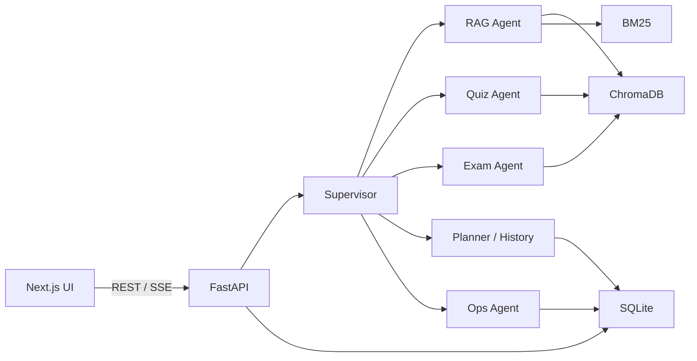
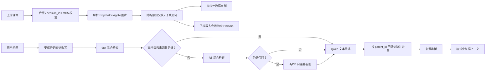
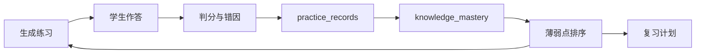

# DeepRevision 架构说明

## 1. 系统边界

DeepRevision 的输入是课程课件、用户问题和练习作答，输出是基于课件证据的回答、练习题、试卷、判分结果和复习优先级。

系统不承担用户认证、多租户隔离、分布式任务恢复或模型托管。当前目标是可本地演示、可解释、可检查。

## 2. 请求链路



前端通过 Next.js Route Handler 代理 API。普通请求由 catch-all 代理转发；`/api/chat/stream` 使用专用代理，原样透传 SSE chunk，并把客户端取消信号传给上游。

## 3. Supervisor 范式

本项目属于 Supervisor 编排的分层多 Agent，而不是多个 Agent 自由对话的群聊架构。

Supervisor 负责：

1. 读取当前问题和必要的会话上下文。
2. 对高确定性意图执行规则预检。
3. 对其余请求输出结构化的 `rewritten_query`、`route`、`params` 和 `reason`。
4. 将任务交给 RAG、Quiz、Exam、Planner、History、Ops 或 Chitchat 节点。
5. 在模型路由失败时执行关键词兜底。

这种设计的原因是课程复习任务边界较明确。集中路由比 Agent 互相协商更容易限制成本、排查误路由并展示执行轨迹。

## 4. RAG 数据流



### 4.1 入库

- `session_id` 经过白名单校验并决定数据目录与 collection。
- 上传最多 5 个文件，按内容 MD5 去重。
- 课件按章节/连续 3～5 页形成父块，父块内生成细粒度子块；只有子块执行 Embedding。
- 父块与子块保存 `document_id / parent_id / chunk_id / chapter / section / page_start / page_end / content_type / parser` 等可追踪元数据。
- 文件状态为 `processing / completed / failed`，失败项可重试。
- 支持 `.txt/.pdf/.docx/.pptx` 和常见图片；不宣称支持依赖缺失的旧 Office 格式。
- 删除或重新入库会更新知识库版本，使旧上下文缓存失效。

### 4.2 检索

BM25 与向量检索并行返回有序列表，使用加权 RRF 融合：

```text
score(document) = sum(weight_i / (k + rank_i))
```

RRF 的价值是只依赖名次，不直接比较 BM25 分数和向量相似度。融合后再调用
`qwen3.7-text-rerank` 精排小候选集；失败时 fail-open 回退到 RRF 顺序。
重排对象是子块，完成后通过 `parent_id` 回溯父块并去重。

### 4.3 fast / full

| 档位 | 候选上限 | 最终片段上限 | 用途 |
| --- | ---: | ---: | --- |
| fast | 8 个子块 | 4 个父块 | 默认路径，控制问答延迟 |
| full | 16 个子块 | 6 个父块 | fast 文档不足或来源单一时升级 |

升级阈值来自 `config/chroma.yml`：默认文档少于 3 条或来源少于 2 个即升级。HyDE 只在升级后仍低召回时触发，避免每个请求都额外调用模型。

### 4.4 可以去掉哪些步骤

- 最终回答由 RAG SubAgent 统一生成，因此删除原先未调用的二次 RAG 总结链。
- 重排只处理 RRF 后的小候选集，并设置 8 秒超时；失败时保留 RRF 顺序，避免外部服务拖垮主链路。
- 只缓存 `rag_chat` 的检索上下文；Quiz/Exam 不复用旧上下文，减少连续出题重复。
- 删除没有消费方的启动预热缓存，避免启动即执行多路检索。

## 5. Quiz / Exam 生成

Quiz 和 Exam 使用受控的 Generate -> Critique -> Revise 工作流。这里的 Critique 不是为了展示“多 Agent”名词，而是补足生成模型不能稳定满足的结构约束。

确定性质量门检查：

- 请求题量与实际题量
- 题型和编号
- 选择题选项完整性
- 答案与解析
- 重复题
- 试卷总分与题型分布
- 术语风格和课件证据

本地检查通过时可以跳过 LLM 评审。需要修订时限制轮数；预算超时或证据不足会写入 `delivery_mode` 和 `degrade_reason`，必要时拒绝交付。

Exam 将大试卷按题型分阶段生成，失败时只重跑失败阶段，避免整卷重做。

## 6. 学习闭环



SQLite 保存会话、消息、练习、mastery、题目签名和长期记忆。数据库开启 WAL，并为会话与 mastery 查询建立索引。

mastery 使用作答次数、正确次数、近期连错和时间信息计算，用于排序“下一步先复习什么”。它是启发式学习画像，不应描述为经过教育数据验证的认知诊断模型。

## 7. Ops 与安全

Ops Agent 用于会话、消息、课件和练习记录等工具操作。删除会话、清空记录、删除课件等高风险动作要求二次确认；确定性历史操作可直接解析为工具参数，防止模型只口头宣告成功。

文件接口对 `session_id` 和文件名分别校验，并在解析路径后检查仍位于会话目录内，降低路径遍历风险。

## 8. 数据与部署取舍

当前组合为 FastAPI + 本地 SQLite + 本地 Chroma：

- 优点：一个仓库即可运行，数据可直接检查，适合面试 Demo。
- 限制：后台入库任务不持久化，多实例间不共享内存缓存，本地文件需要卷挂载。

生产化演进顺序应是：

1. 后台入库迁移到可恢复任务队列。
2. SQLite 迁移 PostgreSQL，文件迁移对象存储。
3. 增加认证、租户权限和审计日志。
4. 扩充固定检索/出题评测集，持续校准父子块大小、召回预算和重排阈值。
5. 基于实际负载补充限流、追踪和容量指标。

## 9. 可观测性

- SSE 链路记录首 token 时延、终止原因和事件计数。
- RAG 记录缓存命中、fast 到 full 升级、HyDE 触发和检索时延。
- Quiz/Exam 返回质量门状态、交付模式和降级原因。
- `GET /health`、`GET /api/chat/metrics`、`GET /api/chat/tokens` 提供 Demo 级运行检查。
